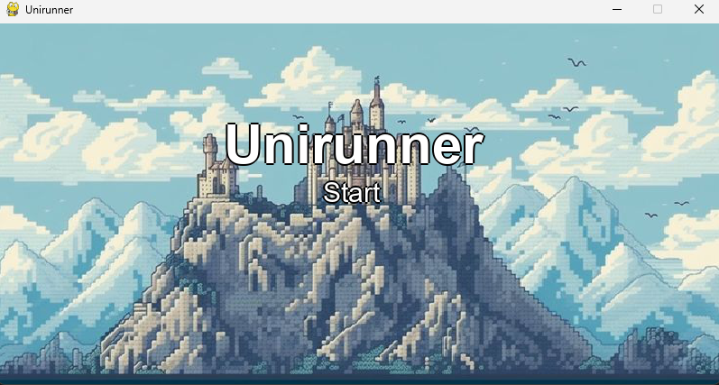
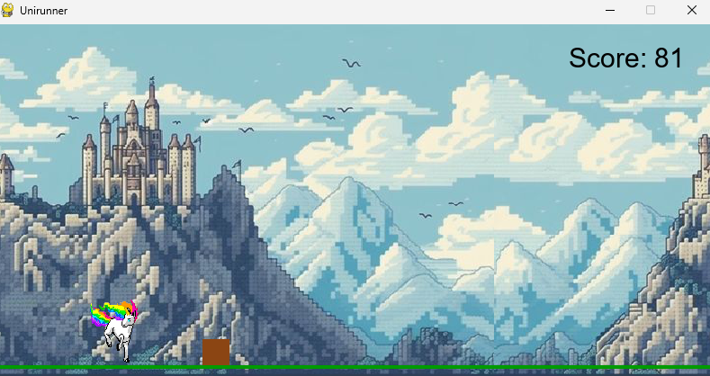
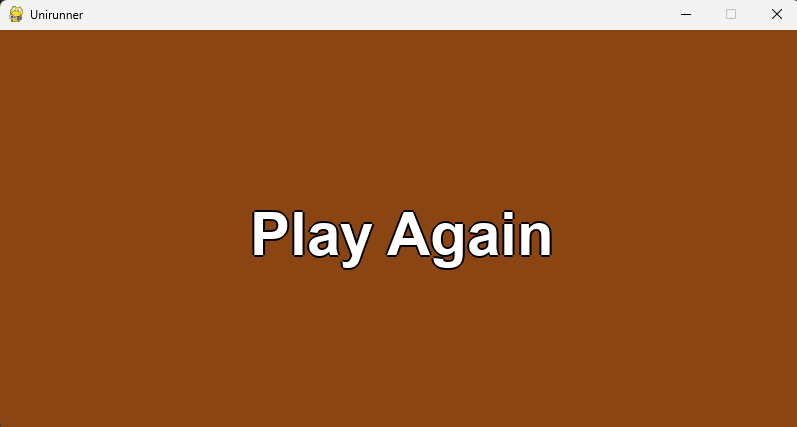

# 🦄 Unirunner

🎮 **Unirunner** — це проста, але атмосферна 2D-платформер-гра про єдинорога, який утікає від… какашок 😅  
Реалізована за допомогою **Python** та **Pygame**.


## 📸 Скриншоти

*(Сюди можна вставити скріншот гри — просто додай файл до репозиторію і встав зображення ось так:)*  
``
``
``
=======
## 📸 Скриншоти 

### Початковий екран


### Геймплей


### Завершення гри 

>>>>>>> 5dfda0a (Додано зображення і оновлено README)


## 🚀 Як грати

- Натисни `Пробіл`, щоб стрибнути.
- Натисни `Пробіл + ще раз`, щоб зробити **суперстрибок**.
- Уникай перешкод!
- З кожним рівнем гра стає швидшою 🌪️
- При програші — коричневий фон і кнопка **Play Again** 😁

## 🧠 Механіки

- ✅ Біжучий фон
- ✅ Подвійний стрибок
- ✅ Плавна анімація переходу до Game Over
- ✅ Очки в правому верхньому куті
- ✅ Рівні, що підвищують складність
- ✅ Стартовий екран та перезапуск

## 📦 Встановлення

### 🔹 Вимоги:
- Python 3.10+
- Pygame

### 🔹 Інсталяція:

```bash
git clone https://github.com/heyitskatya/unirunner.git
cd unirunner
pip install -r requirements.txt
python unicorn_game.py
